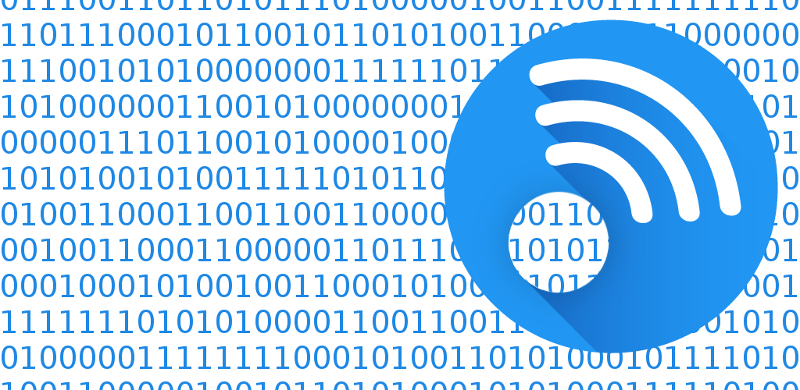

<!--  --> 

# SensorStreamer2

**This is a fork of the original app.**

The goal of my fork is to also implement 6DOF Pose estimation.

Here's a demo where I use this to rotate objects in Blender. 
https://www.youtube.com/watch?v=B_9xWQpGzn4


The original app (not made by me) is available at the Play Store: [SensorStreamer](https://play.google.com/store/apps/details?id=cz.honzamrazek.sensorstreamer)

## Supported Features

- streaming of values from any sensor in the phone (as far as the sensor is
  supported by Android API)
- stream data over TCP sockets in
    - client mode
    - server mode
- stream data in
    - JSON object
    - binary packet

## Format of the JSON Packet

The packets contain a JSON object as the top level entity. This object contains
a field for each sensor. Each sensor supplies two values:

- `timestamp` (in form of nano seconds)
- `value` which is either a single float value or a 3D array of floats. For
  precise meaning of these values, see [Android Sensor Reference](https://developer.android.com/guide/topics/sensors/sensors_motion.html#sensors-motion-accel).

As it is impossible to capture value from multiple sensor at the same time,
time-stamp is included for each sensor independently. There should be only small
differences in this timestamps, however, if you application requires precise
timing, this value might come handy.

## Format of the Binary Packet

Binary packet is designed to be as simple and as compact as possible. The format
is following:

```
[0x80] [timestamp 8 bytes] [sensor values 1 or 3 float] ... [sensor values 1 or 3 float]
```

Timestamp is optional and can be omnited. The sensors are in the exact same
order as the configuration in app says. This packet contains only one timestamp
in order to be as compact as possible.

## Timing

Due to the restrictions of Android API, it no possible to specify an exact
frequency for sensor reading. Only 4 modes are available with frequencies
roughly 5 Hz, 16 Hz, 100 Hz and the fastest possible mode. Note, that there no
guarantee on the timing - the sensor might not be able to deliver values faster.
In such a case, the frequency is limited by the slowest sensor in the packet.

## Future Plans

- make the UI more usable
- support UDP connection
- support Bluetooth connection
- bugfixes

## Author

Developed as a quick dirty hack by Jan "yaqwsx" Mrázek, graphics made by [Martin
Mikšík](https://github.com/mamiksik).
